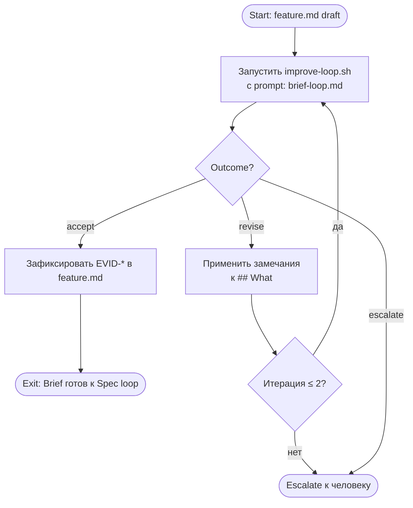

# Brief Improve Loop

Малый цикл улучшения Brief — итеративная проверка секции `## What` в `feature.md` до достижения exit criteria.

**Scope:** только `## What` (Problem, Outcome, Scope/REQ-*, Non-Scope/NS-*, Constraints/ASM-*/CON-*/DEC-*).
**Out of scope:** `## How`, `## Verify` — они принадлежат spec improve loop.

## Диаграмма



## Entry Criteria

Цикл запускается когда выполнены **все**:

- [ ] `feature.md` создан по шаблону (`short.md` или `large.md`)
- [ ] секция `## What` заполнена: есть хотя бы Problem, ≥ 1 `REQ-*`, ≥ 1 `NS-*`
- [ ] `implementation-plan.md` отсутствует (Brief проверяется до планирования)

## Exit Criteria

Цикл завершается с outcome **`accept`** когда **все**:

- [ ] каждый `REQ-*` описывает конкретное поведение, а не намерение
- [ ] каждый `REQ-*` однозначен: два независимых агента прочитают одинаково
- [ ] нет `REQ-*`, дублирующего другой
- [ ] `NS-*` достаточно, чтобы агент не додумывал scope
- [ ] Problem описывает наблюдаемый симптом или ограничение, а не желаемое решение
- [ ] если есть `MET-*` — каждая метрика имеет baseline, target и measurement method
- [ ] если есть `ASM-*` / `CON-*` / `DEC-*` — они не противоречат `REQ-*` и `NS-*`

## Escalation Rules

| Условие | Действие |
|---|---|
| `revise` на 3-й итерации подряд | остановиться, передать человеку с пронумерованными замечаниями |
| `escalate` от агента | остановиться немедленно, описать upstream-конфликт, ждать решения человека |
| замечания повторяются без изменений в артефакте | остановиться, зафиксировать как блокер |

## Runner Contract

Запуск:
```bash
./scripts/improve-loop.sh \
  memory-bank/flows/templates/prompts/brief-loop.md \
  memory-bank/features/FT-XXX/feature.md
```

### Артефакты, которые runner обновляет или возвращает

| Артефакт | Действие | Когда |
|---|---|---|
| `memory-bank/features/FT-XXX/feature.md` | агент вносит правки в `## What` | при `revise` |
| `.review-results/FT-XXX/review-brief-NN.md` | runner сохраняет полный вывод | после каждой итерации |
| `feature.md` секция Evidence | агент добавляет `EVID-*` с `accept`-записью | при `accept` |
| `run-state/FT-XXX/stage-log.md` | runner обновляет строку `brief-loop` | при `accept` |

### Формат записи в Evidence при accept

```
EVID-XX: Brief loop — accept. YYYY-MM-DD. improve-loop.sh / evaluator agent
```

## Связь с feature-flow

Brief improve loop — предварительный шаг перед gate **Draft → Design Ready**.
После `accept` brief loop агент переходит к spec improve loop.
Gate DR → DR не закрывается до прохождения обоих циклов.
