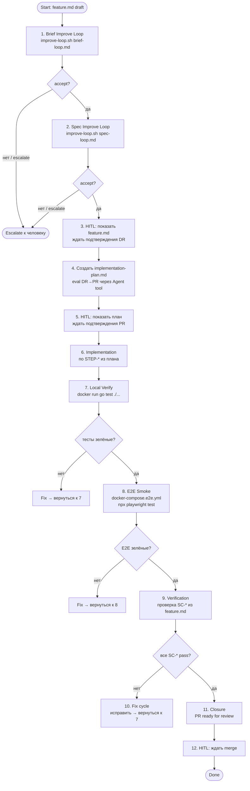

# Feature Execution Loop

Большой цикл проводит фичу через полный SDLC с сохранением состояния после каждого этапа, чтобы следующая сессия могла продолжить без пересказа.

## State-pack

После каждого значимого этапа обновляются три артефакта:

| Артефакт | Роль |
|---|---|
| `run-state/FT-XXX/active-context.md` | текущий stage, blocked/pending, ключевые решения |
| `run-state/FT-XXX/stage-log.md` | журнал пройденных этапов с outcome и ссылками на evidence |
| `HANDOFF.md` (корень проекта) | сессионный entry point для следующего агента |

## Диаграмма



## Этапы

### 1. Brief Improve Loop

```bash
./scripts/improve-loop.sh \
  memory-bank/flows/templates/prompts/brief-loop.md \
  memory-bank/features/FT-XXX/feature.md
```

- Итерации до `accept` (max 2, затем escalate)
- **State update:** `stage-log.md` строка `brief-loop` → done/escalated

### 2. Spec Improve Loop

```bash
./scripts/improve-loop.sh \
  memory-bank/flows/templates/prompts/spec-loop.md \
  memory-bank/features/FT-XXX/feature.md
```

- Итерации до `accept` (max 2, затем escalate)
- **State update:** `stage-log.md` строка `spec-loop` → done/escalated

### 3. HITL — Design Ready gate

**⛔ STOP.** Показать `feature.md` человеку. Ждать явного подтверждения перехода в Design Ready.

- **State update:** `active-context.md` → stage: awaiting-dr-approval

### 4. Implementation Plan

- Создать `implementation-plan.md` по шаблону
- Запустить evaluator agent (DR→PR gate из `eval.md`)
- **State update:** `stage-log.md` строка `plan` → done

### 5. HITL — Plan Ready gate

**⛔ STOP.** Показать `implementation-plan.md` человеку. Ждать явного подтверждения перехода в Plan Ready.

- **State update:** `active-context.md` → stage: awaiting-pr-approval

### 6. Implementation

Выполнить `STEP-*` из `implementation-plan.md` по порядку.

- **State update:** после каждого `CP-*` обновить `active-context.md` → completed steps

### 7. Local Verify

```bash
docker run --rm \
  -v "$(pwd)":/app -w /app \
  -v lfcru_gomod:/root/go/pkg/mod \
  golang:1.23-alpine \
  go test ./...
```

- Если красные → fix и повторить
- **State update:** `stage-log.md` строка `unit-tests` → pass/fail

### 8. E2E Smoke (безопасный контур)

```bash
# Поднять dev-стек
docker compose -f docker-compose.dev.yml up -d

# Поднять e2e-контейнер (app:8081 → lfcru_test)
docker compose -f docker-compose.e2e.yml up -d

# Запустить тесты
npx playwright test
```

- Если красные → fix и повторить с этапа 7
- **State update:** `stage-log.md` строка `e2e-smoke` → pass/fail

### 9. Verification по SC-*

Пройти по каждому `SC-*` из `feature.md`, зафиксировать pass/fail в `EVID-*`.

- **State update:** `stage-log.md` строка `verification` → pass/blocked

### 10. Fix Cycle

При замечаниях на этапе 9: исправить → вернуться к этапу 7. Max 3 итерации, затем escalate.

### 11. Closure

- Simplify review (см. `testing-policy.md`)
- PR перевести из draft в ready for review
- **State update:** `stage-log.md` строка `closure` → done

### 12. HITL — Ждать merge

**⛔ STOP.** Ждать merge PR в `main`. После merge:
- Удалить worktree
- Обновить `feature.md` → `delivery_status: done`
- Обновить `implementation-plan.md` → `status: archived`

## Resume Protocol

При возобновлении после прерывания:

1. Прочитать `HANDOFF.md` → найти FT_ID и текущий stage
2. Прочитать `run-state/FT-XXX/active-context.md` → восстановить контекст
3. Прочитать `run-state/FT-XXX/stage-log.md` → определить следующий этап
4. Продолжить с первого незавершённого этапа

## Формат state-артефактов

### active-context.md

```markdown
# Active Context: FT-XXX

**Updated:** YYYY-MM-DD
**Stage:** <текущий этап>
**Status:** in_progress / awaiting-human / blocked

## Completed
- brief-loop: accept (YYYY-MM-DD)
- spec-loop: accept (YYYY-MM-DD)

## Current
<что делается прямо сейчас>

## Blocked / Pending
<что ждёт человека или внешнего события>

## Key Decisions
<решения, принятые в ходе прогона>
```

### stage-log.md

```markdown
# Stage Log: FT-XXX

| Stage         | Status      | Outcome   | Date       | Ref |
|--------------|-------------|-----------|------------|-----|
| brief-loop   | done        | accept    | YYYY-MM-DD | .review-results/FT-XXX/review-brief-01.md |
| spec-loop    | done        | accept    | YYYY-MM-DD | .review-results/FT-XXX/review-spec-01.md |
| dr-approval  | done        | approved  | YYYY-MM-DD | — |
| plan         | done        | accept    | YYYY-MM-DD | .review-results/FT-XXX/review-plan-01.md |
| pr-approval  | done        | approved  | YYYY-MM-DD | — |
| impl         | done        | —         | YYYY-MM-DD | PR #XX |
| unit-tests   | done        | pass      | YYYY-MM-DD | — |
| e2e-smoke    | done        | pass      | YYYY-MM-DD | e2e/test-report/ |
| verification | done        | pass      | YYYY-MM-DD | artifacts/ft-xxx/ |
| closure      | done        | —         | YYYY-MM-DD | PR #XX ready |
```
