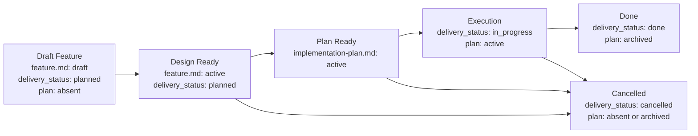

# Feature Flow

> **Scope:** этот flow применяется только к workflow «Средняя или большая фича» (и малым фичам, использующим `short.md`). Для bug-fix используется облегчённый пакет без `feature.md` и `implementation-plan.md` — см. `workflows.md` § «Баг-фикс».

Этот документ задает порядок появления feature-артефактов. Агент должен вести feature package по стадиям и не создавать downstream-артефакты раньше, чем созрел их upstream-owner.

## Package Rules

1. Все документы одной фичи живут в `memory-bank/features/FT-XXX/`.
2. **Feature = vertical slice.** Одна фича — одна единица пользовательской ценности, пронизывающая все затронутые слои системы (UI, API, storage, infra). Горизонтальная нарезка ("все endpoints", "весь UI") допустима только для чисто инфраструктурных или рефакторинговых задач и должна быть явно обоснована через `NS-*`.
3. `feature.md` — canonical owner intent, delivery-scoped target outcome/KPI, design и verify для delivery-единицы.
4. `README.md` создается вместе с `feature.md` и остается routing-слоем на всем lifecycle.
5. `implementation-plan.md` — derived execution-документ. Он не должен существовать, пока sibling `feature.md` не стал design-ready.
6. Для canonical `feature.md`, feature-level `README.md`, `implementation-plan.md` и eval-артефактов (`evals/`) используй wrapper-шаблоны из `memory-bank/flows/templates/feature/`: сам template-файл имеет `doc_function: template`, а frontmatter/body инстанцируемого документа живут внутри embedded template contract.
6а. `evals/` — папка eval-артефактов фичи. Создаётся при Bootstrap вместе с `README.md` и `feature.md`. Содержит `strategy.md` (eval-стратегия, заполняется при Bootstrap), gate-eval файлы (`DR-eval.md`, `PR-eval.md`, `Done-eval.md` — создаются evaluator agent при соответствующем gate) и `summary.md` (обновляется при каждом gate, финализируется при Done). Шаблоны — в `templates/feature/evals/`.
7. Смысл стабильных идентификаторов (`REQ-*`, `NS-*`, `CHK-*`, `STEP-*` и т.д.) задается в секции «Stable Identifiers» ниже.
8. Acceptance scenarios (`SC-*`) покрывают vertical slice end-to-end: от входного события до наблюдаемого результата через все затронутые слои. Тестирование отдельного слоя в изоляции допустимо как implementation detail плана, но не заменяет end-to-end acceptance.
9. **Связь с task tracker.** При создании feature package агент обязан добавить в исходную задачу или ticket ссылки на `feature.md` и, после появления, на `implementation-plan.md`. Это обеспечивает навигацию из task tracker к спецификации без ручного поиска по репозиторию.
10. Если фича является частью более крупной инициативы, `feature.md` может зависеть от PRD из `memory-bank/prd/`, но PRD не заменяет сам feature package.
11. Если фича создает новый устойчивый сценарий проекта или materially changes существующий, соответствующий `UC-*` в `memory-bank/use-cases/` должен быть создан или обновлен до closure.
12. Если фича вводит новые доменные или архитектурные термины (сущности, паттерны, внешние концепции), соответствующие записи в memory-bank/domain/glossary.md должны быть добавлены или обновлены к моменту Design Ready. Агент проверяет glossary при создании feature.md и пополняет его при появлении новых терминов в ходе работы.

## Выбор шаблона `feature.md`

`short.md` допустим только если одновременно выполняются все условия:

1. фичу можно описать через `REQ-*`, `NS-*`, один `SC-*`, максимум один `CON-*`, один `EC-*`, один `CHK-*` и один `EVID-*`;
2. в `feature.md` не нужны `ASM-*`, `DEC-*`, `CTR-*`, `FM-*`, rollout/backout-правила или ADR-dependent design rules;
3. изменение не вводит и не меняет API, event, schema, file format, CLI или env contract;
4. verify укладывается в один основной check без quality slices и без нескольких acceptance scenarios.

Если хотя бы одно условие нарушается, агент обязан выбрать или сделать upgrade до `large.md` до продолжения работы. Upgrade обязателен и в том случае, если фича стартовала как `short.md`, но по ходу работы потребовала `ASM-*`, `DEC-*`, `CTR-*`, `FM-*`, больше одного acceptance scenario или больше одного `CHK-*` / `EVID-*`.

## Lifecycle

## Transition Gates

Каждый gate — набор проверяемых предикатов. Переход допустим тогда и только тогда, когда все предикаты истинны.

### Bootstrap Feature Package

- [ ] если задача зафиксирована в task tracker → карточка переведена в статус "обсуждается" (PLANNING) до любых файловых операций
- [ ] определён номер фичи (следующий FT-XXX из `memory-bank/features/`)
- [ ] создан git worktree: `git worktree add ../lfcru_forum-FT-XXX -b feat/FT-XXX-slug`
- [ ] если задача зафиксирована в task tracker → карточка переведена в IN PROGRESS сразу после создания worktree
- [ ] создан draft PR до первого коммита; все последующие commits/push/CI привязаны к нему
- [ ] вся дальнейшая работа ведётся **исключительно** внутри worktree-папки `../lfcru_forum-FT-XXX`; прямая работа в `main` запрещена
- [ ] `README.md` создан по шаблону `templates/feature/README.md` (внутри worktree)
- [ ] выбран template-тип `feature.md` по критериям из секции «Выбор шаблона `feature.md`» (`short.md` или `large.md`)
- [ ] `feature.md` создан по выбранному шаблону (внутри worktree)
- [ ] создана папка `evals/` с `strategy.md` и `summary.md` по шаблонам из `templates/feature/evals/` (внутри worktree); `strategy.md` заполнен формами для каждого gate согласно типу фичи
- [ ] `implementation-plan.md` отсутствует

### Draft → Design Ready

> **Feature.md review (для `large.md`):** перед показом человеку запусти evaluator agent через **Agent tool**:
> 1. Инстанциируй шаблон `memory-bank/flows/templates/prompts/review-feature-md.md` — замени `{{FT_ID}}`, `{{FEATURE_PATH}}`, `{{DATE}}`
> 2. Сохрани результат в `memory-bank/features/FT-XXX/prompts/review-feature-md.md`
> 3. Запусти субагент через **Agent tool** с содержимым этого файла
> 4. Если `revise` — исправь `feature.md` и перезапусти (max 2 итерации, после — escalate к человеку)
> 5. Если `accept` — evaluator записывает EVID-* в `feature.md`, создаёт `evals/DR-eval.md` по шаблону `templates/feature/evals/gate-eval.md` и обновляет `evals/summary.md`; показывай документ человеку
>
> Для `short.md` — self-check достаточен; результат фиксируется в `evals/DR-eval.md` самим агентом.

- [ ] `feature.md` → `status: active`
- [ ] секция `What` содержит ≥ 1 `REQ-*` и ≥ 1 `NS-*`
- [ ] секция `Verify` содержит ≥ 1 `SC-*`
- [ ] каждый `REQ-*` прослеживается к ≥ 1 `SC-*` через traceability matrix
- [ ] секция `Verify` содержит ≥ 1 `CHK-*` и ≥ 1 `EVID-*`
- [ ] если deliverable нельзя принять без negative/edge coverage → ≥ 1 `NEG-*`
- [ ] `[human]` `feature.md` показан человеку и получено явное подтверждение перехода в Design Ready

### Design Ready → Plan Ready

> **Plan eval (для `large.md`):** после создания плана запусти evaluator agent через **Agent tool**:
> 1. Инстанциируй шаблон `memory-bank/flows/templates/prompts/review-implementation-plan.md` — замени `{{FT_ID}}`, `{{FEATURE_PATH}}`, `{{DATE}}`
> 2. Сохрани результат в `memory-bank/features/FT-XXX/prompts/review-implementation-plan.md`
> 3. Запусти субагент через **Agent tool** с содержимым этого файла
> 4. Если `revise` — исправь `implementation-plan.md` и перезапусти (max 2 итерации, после — escalate к человеку)
> 5. Если `accept` — evaluator записывает EVID-* в `feature.md`, создаёт `evals/PR-eval.md` по шаблону `templates/feature/evals/gate-eval.md` и обновляет `evals/summary.md`; показывай план человеку
>
> Для `large.md` с планом ≤ 3 STEP-* — self-check допустим. Для `short.md` — self-check достаточен. В обоих случаях результат фиксируется в `evals/PR-eval.md`.

- [ ] агент выполнил grounding: прошёлся по текущему состоянию системы (relevant paths, existing patterns, dependencies) и зафиксировал результат в discovery context секции `implementation-plan.md`
- [ ] `implementation-plan.md` создан по шаблону `templates/feature/implementation-plan.md`
- [ ] `implementation-plan.md` → `status: active`
- [ ] `implementation-plan.md` содержит ≥ 1 `PRE-*`, ≥ 1 `STEP-*`, ≥ 1 `CHK-*`, ≥ 1 `EVID-*`
- [ ] discovery context в `implementation-plan.md` содержит: relevant paths, local reference patterns, unresolved questions (`OQ-*`), test surfaces и execution environment
- [ ] `[human]` `implementation-plan.md` показан человеку и получено явное подтверждение перехода в Plan Ready

### Plan Ready → Execution

> Eval: workflow-level check встроен в HARD STOP ниже; `AG-*` = human eval form.

> **⛔ HARD STOP.** Все пункты ниже выполняются **до первого коммита с кодом** и не могут быть пропущены или отложены. Коммит в `main` без worktree — нарушение flow.

- [ ] `feature.md` → `delivery_status: in_progress`
- [ ] `implementation-plan.md` → `status: active`
- [ ] `implementation-plan.md` фиксирует test strategy: automated coverage surfaces, required local suites (и CI suites, когда CI настроен)
- [ ] каждый manual-only gap имеет причину, ручную процедуру и `AG-*` с approval ref (approver — человек, ответственный за приёмку фичи: автор задачи или team lead)
- [ ] task tracker синхронизирован на Bootstrap (IN PROGRESS выставлен при создании worktree)

### Execution → Done

> Eval: для `large.md` — запусти evaluator через **Agent tool** с промптом из [eval.md#evaluator-agent-protocol](eval.md). Если `revise` — исправь и перезапусти (max 2 итерации, после — escalate к человеку). Для `short.md` — self-check достаточен. В обоих случаях evaluator создаёт `evals/Done-eval.md` по шаблону `templates/feature/evals/gate-eval.md` и финализирует `evals/summary.md` (`status: final`).

- [ ] все `CHK-*` из `feature.md` имеют результат pass/fail в evidence
- [ ] все `EVID-*` из `feature.md` заполнены конкретными carriers (путь к файлу, CI run, screenshot)
- [ ] automated tests для change surface добавлены или обновлены
- [ ] required test suites зелёные локально (и в CI, когда настроен)
- [ ] каждый manual-only gap явно approved человеком (approval ref в `AG-*`)
- [ ] simplify review выполнен: код минимально сложен или complexity обоснована ссылкой на `CON-*`, `FM-*` или `DEC-*`
- [ ] если feature добавляет новый stable flow или materially changes существующий project-level scenario, соответствующий `UC-*` создан или обновлен и зарегистрирован в `memory-bank/use-cases/README.md`
- [ ] PR переведён из draft в ready for review

> **⛔ HARD STOP — ждать merge.** Шаги ниже выполняются **только после того, как PR смержен в `main`**. Закрывать артефакты и удалять worktree до merge — нарушение flow. Агент ждёт подтверждения от человека (или видит merge в `git log`/GitHub) перед продолжением.

- [ ] `[human]` PR merged в `main`
- [ ] worktree удалён: `git worktree remove ../lfcru_forum-FT-XXX` и `git branch -d feat/FT-XXX-slug`
- [ ] `feature.md` → `delivery_status: done`
- [ ] `implementation-plan.md` → `status: archived`

### → Cancelled (из любой стадии после Draft)

- [ ] `feature.md` → `delivery_status: cancelled`
- [ ] `implementation-plan.md` отсутствует ∨ `status: archived`

## Boundary Rules

1. `feature.md` обязан содержать секции `What`, `How`, `Verify`.
2. `Verify` в `feature.md` задает canonical test case inventory delivery-единицы: positive cases через `SC-*`, feature-specific negative coverage через `NEG-*` при необходимости, executable checks через `CHK-*` и evidence через `EVID-*`.
3. Если feature зависит от ADR, `feature.md` ссылается на соответствующий файл в `memory-bank/adr/` и учитывает его `decision_status`; `proposed` не считается finalized design.
4. Если feature зависит от канонического use case, `feature.md` ссылается на соответствующий файл в `memory-bank/use-cases/`. Use case остается owner-ом trigger/preconditions/main flow/postconditions на уровне проекта, а `feature.md` фиксирует только slice-specific реализацию.
5. `implementation-plan.md` остается derived execution-документом: он ссылается на canonical IDs из `feature.md` или ADR, фиксирует test strategy для исполнения, required local/CI suites и approval refs для manual-only gaps и не переопределяет scope, architecture, blockers, acceptance criteria или evidence contract. `CHK-*` и `EVID-*` в `implementation-plan.md` — execution-level checks (проверка шагов исполнения); acceptance-level `CHK-*` и `EVID-*` задаются только в `feature.md` и являются canonical для closure gate.
6. Если меняются scope, architecture, acceptance criteria или evidence contract, сначала обновляется `feature.md` или ADR, потом downstream-план.
7. Если численный target threshold относится только к одной delivery-единице, canonical owner — соответствующий `feature.md`. Поднимать такой KPI в project-level документ можно только после того, как он стал shared upstream fact для нескольких feature.
8. Хороший `implementation-plan.md` начинается с discovery context: relevant paths, local reference patterns, unresolved questions, test surfaces и execution environment должны быть зафиксированы до sequencing изменений.
9. Для рискованных, необратимых или внешне-эффективных действий `implementation-plan.md` должен явно описывать human approval gates и не скрывать их внутри prose шага.

## Test Ownership Summary

Canonical testing policy — [../engineering/testing-policy.md](../engineering/testing-policy.md). Там определены: sufficient coverage, manual-only exceptions, simplify review, verification context separation. Читай policy-документ напрямую — дублирование здесь намеренно исключено во избежание SSoT-нарушений.

## Stable Identifiers

### Feature IDs

| Prefix | Meaning | Used in |
| --- | --- | --- |
| `MET-*` | outcome-метрики | `feature.md` |
| `REQ-*` | scope и обязательные capability | `feature.md` |
| `NS-*` | non-scope | `feature.md` |
| `ASM-*` | assumptions и рабочие предпосылки | `feature.md` |
| `CON-*` | ограничения | `feature.md` |
| `DEC-*` | blocking decisions | `feature.md` |
| `NT-*` | do-not-touch / explicit change boundaries | `feature.md` |
| `INV-*` | инварианты | `feature.md` |
| `CTR-*` | контракты | `feature.md` |
| `FM-*` | failure modes | `feature.md` |
| `RB-*` | rollout / backout stages | `feature.md` |
| `EC-*` | exit criteria | `feature.md` |
| `SC-*` | acceptance scenarios | `feature.md` |
| `NEG-*` | negative / edge test cases | `feature.md` |
| `CHK-*` | проверки | `feature.md`, `implementation-plan.md` |
| `EVID-*` | evidence-артефакты | `feature.md`, `implementation-plan.md` |
| `RJ-*` | rejection rules | `feature.md`, `implementation-plan.md` |

### Plan IDs

| Prefix | Meaning | Used in |
| --- | --- | --- |
| `PRE-*` | preconditions | `implementation-plan.md` |
| `OQ-*` | unresolved questions / ambiguities | `implementation-plan.md` |
| `WS-*` | workstreams | `implementation-plan.md` |
| `AG-*` | approval gates for risky actions | `implementation-plan.md` |
| `STEP-*` | атомарные шаги | `implementation-plan.md` |
| `PAR-*` | параллелизуемые блоки | `implementation-plan.md` |
| `CP-*` | checkpoints | `implementation-plan.md` |
| `ER-*` | execution risks | `implementation-plan.md` |
| `STOP-*` | stop conditions / fallback | `implementation-plan.md` |

### Required Minimum

1. Любой canonical `feature.md` использует как минимум `REQ-*`, `NS-*`, `SC-*`, `CHK-*`, `EVID-*`.
2. Любой `feature.md` со `status: active` задает хотя бы один explicit test case через `SC-*`.
3. Short feature дополнительно допускает только минимальный набор, описанный в `memory-bank/flows/templates/feature/short.md`.
4. Large feature может использовать расширенный набор feature IDs по необходимости.
5. Любой `implementation-plan.md` использует как минимум `PRE-*`, `STEP-*`, `CHK-*`, `EVID-*`; при наличии ambiguity или human approval gates используются `OQ-*` и `AG-*`.

### Traceability Contract

1. Scope в `feature.md` фиксируется через `REQ-*`, non-scope через `NS-*`.
2. Verify в `feature.md` связывает `REQ-*` с test cases через `Acceptance Scenarios`, feature-specific `NEG-*`, `Traceability matrix`, `Test matrix` и `Evidence contract`.
3. `implementation-plan.md` ссылается на canonical IDs из `feature.md` в колонках `Implements`, `Verifies` и `Evidence IDs`.
4. Если sequencing блокируется неизвестностью, план фиксирует её как `OQ-*`, а не прячет в prose.
5. Если выполнение требует человеческого подтверждения для рискованных действий, план фиксирует это через `AG-*`.
6. Если ID начинает использоваться как стабильная сущность, его смысл должен быть совместим с этим документом.
