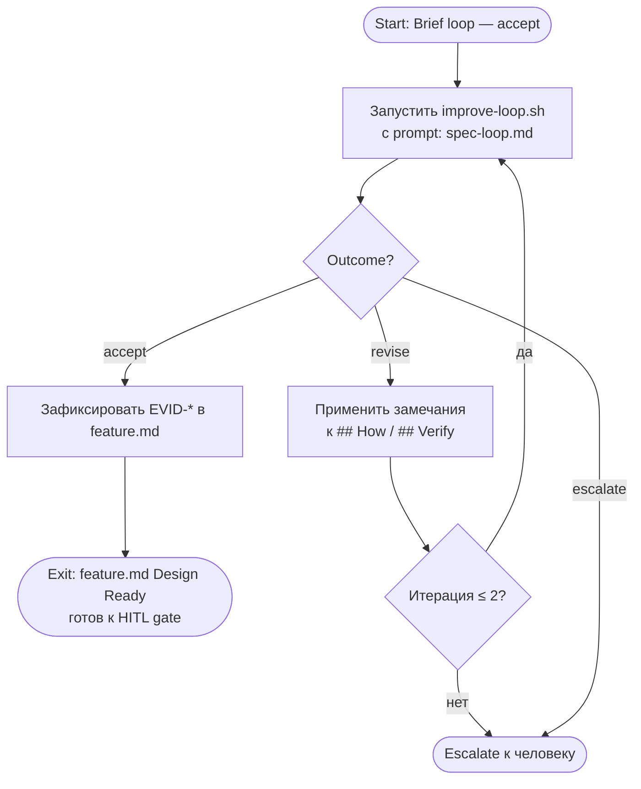

# Spec Improve Loop

Малый цикл улучшения Spec — итеративная проверка секций `## How` и `## Verify` в `feature.md` до достижения exit criteria.

**Scope:** `## How` (Solution, Change Surface, Flow, Contracts, Failure Modes, ADR Dependencies) и `## Verify` (Exit Criteria, Traceability matrix, Acceptance Scenarios, Checks, Evidence).
**Out of scope:** `## What` — принадлежит brief improve loop и считается стабильным на входе.

## Диаграмма



## Entry Criteria

Цикл запускается когда выполнены **все**:

- [ ] brief improve loop завершён с outcome `accept` (EVID-* записан в feature.md)
- [ ] секция `## How` заполнена: есть Solution, Change Surface, Flow
- [ ] секция `## Verify` заполнена: есть ≥ 1 `SC-*`, ≥ 1 `CHK-*`, ≥ 1 `EVID-*`

## Exit Criteria

Цикл завершается с outcome **`accept`** когда **все**:

**How:**
- [ ] Solution описывает конкретный технический подход и главный trade-off
- [ ] Change Surface содержит реальные пути из репозитория (не шаблонные заглушки)
- [ ] Flow описывает вход, обработку и выход в наблюдаемых терминах
- [ ] если есть `CTR-*` — каждый контракт имеет producer, consumer и что важно соблюдать
- [ ] если есть `FM-*` — покрыты критичные failure modes (auth, data loss, XSS)
- [ ] если feature зависит от ADR — ADR явно указан с `decision_status`

**Verify:**
- [ ] каждый `REQ-*` прослеживается к ≥ 1 `SC-*` через traceability matrix
- [ ] каждый `SC-*` описывает наблюдаемый результат (Given / When / Then или эквивалент)
- [ ] каждый `CHK-*` имеет команду или ручную процедуру (не "проверить вручную" без инструкции)
- [ ] каждый `EVID-*` имеет конкретный path contract (не "где-нибудь")
- [ ] если deliverable нельзя принять без negative coverage → присутствует ≥ 1 `NEG-*`
- [ ] если feature отправляет POST/PUT/DELETE → CSRF зафиксирован через `ASM-*` или `CON-*`

## Escalation Rules

| Условие | Действие |
|---|---|
| `revise` на 3-й итерации подряд | остановиться, передать человеку с пронумерованными замечаниями |
| `escalate` от агента | остановиться немедленно, описать upstream-конфликт (конфликт с ADR, неясный scope), ждать решения человека |
| замечания повторяются без изменений в артефакте | остановиться, зафиксировать как блокер |
| `DEC-*` в `## What` всё ещё не разрешён | не начинать spec loop, эскалировать |

## Runner Contract

Запуск:
```bash
./scripts/improve-loop.sh \
  memory-bank/flows/templates/prompts/spec-loop.md \
  memory-bank/features/FT-XXX/feature.md
```

### Артефакты, которые runner обновляет или возвращает

| Артефакт | Действие | Когда |
|---|---|---|
| `memory-bank/features/FT-XXX/feature.md` | агент вносит правки в `## How` / `## Verify` | при `revise` |
| `.review-results/FT-XXX/review-spec-NN.md` | runner сохраняет полный вывод | после каждой итерации |
| `feature.md` секция Evidence | агент добавляет `EVID-*` с `accept`-записью | при `accept` |
| `run-state/FT-XXX/stage-log.md` | runner обновляет строку `spec-loop` | при `accept` |

### Формат записи в Evidence при accept

```
EVID-XX: Spec loop — accept. YYYY-MM-DD. improve-loop.sh / evaluator agent
```

## Связь с feature-flow

Spec improve loop — финальный шаг перед gate **Draft → Design Ready**.
После `accept` spec loop `feature.md` готов к показу человеку (HITL gate DR).
Оба цикла вместе заменяют первый вызов evaluator agent из `eval.md` — evaluator agent для DR gate больше не нужен отдельно: его роль выполняет `improve-loop.sh`.
